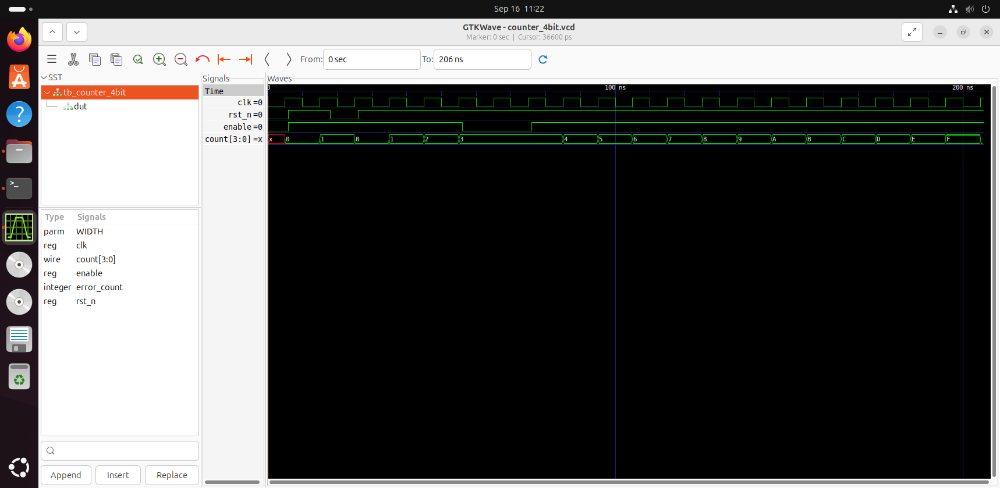

# Parameterized 4-bit Counter

**Status:** Verified in RTL simulation
**HDL:** SystemVerilog
**Tools:** Icarus Verilog, GTKWave

> A small synthesizable RTL design demonstrating sequential logic, parameterization, reset behavior, self-checking verification, and waveform analysis.

## Project Overview

This project implements a parameterized counter using SystemVerilog.

The design follows a basic RTL development workflow:

Specification → RTL Design → Testbench → Simulation → Waveform Analysis

The objective is to practice clean RTL coding, synchronous sequential logic,
functional verification, and simulation debugging.

---

## Design Specification

### Interface

| Signal | Direction | Description |
|---|---|---|
| `clk` | Input | System clock |
| `rst_n` | Input | Active-low synchronous reset |
| `enable` | Input | Enables counting |
| `count` | Output | Parameterized counter value |

### Behavior

- When `rst_n = 0`, the counter is synchronously reset to `0`.
- When `rst_n = 1` and `enable = 1`, the counter increments by `1` on each rising edge of `clk`.
- When `enable = 0`, the counter holds its current value.
- The counter wraps around naturally after reaching its maximum value.
- The counter width is configurable through the `WIDTH` parameter.

---

## RTL Architecture

The design consists of a single sequential RTL block:

- Clocked counter register
- Active-low synchronous reset
- Enable control
- Parameterized counter width

Main signal flow:

`clk + rst_n + enable → Counter Logic → count`

---

## RTL Implementation

Main RTL source:

`rtl/counter_4bit.sv`

The design uses:

- SystemVerilog
- `logic` signals
- `always_ff`
- Non-blocking assignments
- Parameterized counter width
- Active-low synchronous reset

Default configuration:

```systemverilog
counter_4bit #(
    .WIDTH(4)
) u_counter (
    .clk    (clk),
    .rst_n  (rst_n),
    .enable (enable),
    .count  (count)
);
```

## Verification

Testbench:

`tb/tb_counter_4bit.sv`

The testbench is self-checking and verifies:

- Reset behavior
- Counter increment
- Hold behavior when `enable = 0`
- Overflow / wrap-around
- Parameterized width behavior

Simulation tool:

**Icarus Verilog**

Waveform viewer:

**GTKWave**

---

## Verification Flow

The project follows this verification flow:

RTL → Self-checking Testbench → Icarus Verilog Simulation → PASS / FAIL Checks → GTKWave

This approach is intended to verify functionality before moving the design
to FPGA or ASIC implementation.

---

## Simulation Result

The counter behavior is verified through simulation.

Expected sequence:

Reset → `count = 0`

When enabled:

`0 → 1 → 2 → 3 → ...`

After reaching the maximum value:

`MAX → 0`

When disabled:

`count` holds its current value.

### Waveform



The waveform demonstrates clock activity, reset behavior, counter transitions,
and enable-controlled counting.

---

## Expected Behavior

| Condition | Expected Result |
|---|---|
| `rst_n = 0` | `count = 0` |
| `rst_n = 1`, `enable = 1` | Counter increments |
| `rst_n = 1`, `enable = 0` | Counter holds |
| Counter reaches maximum | Wraps to `0` |

---

## Project Structure

```text
counter_4bit/
├── docs/
├── fpga/
├── README.md
├── rtl/
│   └── counter_4bit.sv
├── specification.md
├── tb/
│   └── tb_counter_4bit.sv
└── waveform/
    └── counter_4bit_simulation.png
```

> The `fpga/` directory is reserved for future FPGA implementation.

---

## Skills Demonstrated

### RTL / Digital Design

- Verilog / SystemVerilog
- Sequential logic
- Counter design
- Parameterized RTL
- Synchronous reset
- Clocked logic
- Enable-controlled sequential logic

### Verification

- Testbench development
- Self-checking simulation
- Functional verification
- Waveform analysis
- Simulation debugging

### Development Workflow

- Linux / Ubuntu
- Icarus Verilog
- GTKWave
- Git / GitHub
- Technical documentation

---

## Learning Outcome

This project establishes the basic RTL development and verification workflow
used throughout the repository:

Specification → RTL → Testbench → Simulation → Waveform → Documentation

The same methodology will be applied to more advanced projects involving
finite state machines, FPGA implementation, verification, and ASIC design flow.

---

## Next Step

The next RTL project extends these fundamentals to a finite state machine:

[Traffic Light FSM](../../02_fsm/traffic_light)

---

## Related Projects

- [Traffic Light FSM](../../02_fsm/traffic_light)
- [ASIC RTL-to-GDS Flow](../../13_asic_flow)

---

## Contact

**Ngô Nam**

- Email: [ngonam0291@gmail.com](mailto:ngonam0291@gmail.com)
- LinkedIn: [namngo-rtl-fpga](https://linkedin.com/in/namngo-rtl-fpga)
- GitHub: [namngo0291](https://github.com/namngo0291/rtl-fpga-learning-journey)
